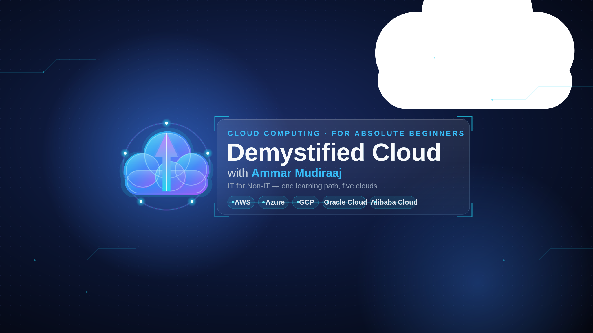

# ☁️ Demystified Cloud — with Ammar Mudiraaj




> **IT for Non-IT.** One ordered path that takes a complete beginner — from Arts, Commerce, Science, or non‑IT engineering — to confidently understanding cloud computing across **AWS, Microsoft Azure, Google Cloud, Oracle Cloud (OCI), and Alibaba Cloud**.

This repository is the **open curriculum** behind the YouTube channel **Demystified Cloud with Ammar Mudiraaj**. The method is simple: **teach the concept first (vendor‑neutral), then show the same concept across all five providers** — so you learn ideas you can carry between clouds, not just where the buttons are.

---

## 🎯 Why this exists

Most cloud tutorials assume you already know networking, Linux, and databases. Beginners get lost the moment a word is used before it's explained. This curriculum fixes that: **every new term gets a plain‑language analogy first, then the technical definition** — and nothing is used before it's taught.

## 👤 Who it's for

- Career switchers and students from **non‑IT** backgrounds (Arts, Commerce, Science, non‑IT engineering).
- Anyone who wants **job‑ready cloud intuition** without memorizing one vendor's menu.
- Learners watching in a second language — sentences are short and concrete.

## 🧠 The teaching method (8 principles)

1. **Non‑IT first** — assume zero background; analogy before jargon.
2. **One single spine** — everyone follows the same ordered path.
3. **Foundation before vendor** — learn the idea before any provider's service.
4. **Category‑parallel** — one concept, then AWS → Azure → GCP → OCI → Alibaba, then a side‑by‑side comparison.
5. **Standalone yet sequential** — each video recaps and bridges.
6. **Hands‑on & free‑tier safe** — every lab has a cost‑safety note.
7. **Retention‑engineered** — strong hook, concrete promise, clear bridge.
8. **Portable mindset** — "same idea, different name/button," never vendor loyalty.

---

## 🗺️ Curriculum at a glance

| Phase | Focus | Videos | Runtime |
|---|---|---|---|
| **Phase 0** | Digital & Computing Literacy (pre‑cloud) | 8 | ~1.3 hrs |
| **Phase 1** | Cloud Foundations + 16 vendor‑neutral domain foundations | 24 | ~4.0 hrs |
| **Phase 2** | Provider Implementations (12 domains × 5 clouds + comparisons) | 72 | ~12.0 hrs |
| **Phase 3** | Apply & Advance (projects, "which cloud?", certs, careers) | 6 | ~1.0 hr |
| **Total** | | **110** | **~18.3 hrs** |

➡️ **Full ordered tree:** [`curriculum/ROADMAP.md`](curriculum/ROADMAP.md)
➡️ **Deep content outlines for the 16 foundation videos:** [`curriculum/FOUNDATION-OUTLINES.md`](curriculum/FOUNDATION-OUTLINES.md)
➡️ **New here? Start with:** [`curriculum/00-START-HERE.md`](curriculum/00-START-HERE.md)

---

## ☁️ What you'll learn across the 5 clouds

The same concept, named in each provider's language (taught vendor‑neutral first):

| Concept | AWS | Azure | Google Cloud | Oracle (OCI) | Alibaba |
|---|---|---|---|---|---|
| Virtual network | VPC | VNet | VPC | VCN | VPC |
| Compute (VMs) | EC2 | Virtual Machines | Compute Engine | OCI Compute | ECS |
| Object storage | S3 | Blob Storage | Cloud Storage | Object Storage | OSS |
| Block / file storage | EBS · EFS | Managed Disks · Files | Persistent Disk · Filestore | Block Volume · File Storage | Cloud Disk · NAS |
| Relational DB | RDS / Aurora | Azure SQL | Cloud SQL / Spanner | Autonomous / Base DB | ApsaraDB RDS |
| NoSQL · cache | DynamoDB · ElastiCache | Cosmos DB · Cache for Redis | Firestore/Bigtable · Memorystore | NoSQL DB · OCI Cache | Tablestore · ApsaraDB Redis |
| Identity (IAM) | IAM | Entra ID + RBAC | Cloud IAM | OCI IAM | RAM |
| Key management | KMS | Key Vault | Cloud KMS | OCI Vault | KMS |
| Serverless functions | Lambda | Functions | Cloud Run functions | OCI Functions | Function Compute |
| Containers / K8s | ECS / EKS | AKS | GKE | OKE | ACK |
| Load balancing | ELB | Load Balancer | Cloud Load Balancing | OCI LB | ALB / NLB |
| DNS · CDN | Route 53 · CloudFront | Azure DNS · Front Door | Cloud DNS · Cloud CDN | OCI DNS · CDN | DNS · CDN |
| Monitoring & logs | CloudWatch | Azure Monitor | Cloud Monitoring | OCI Monitoring | CloudMonitor |
| Infrastructure as Code | CloudFormation | ARM / Bicep | Infrastructure Manager / Terraform | Resource Manager | ROS |
| Messaging / queues | SQS · SNS | Service Bus · Event Grid | Pub/Sub | Queue · Streaming | MNS · MQ |
| Cost & billing | Cost Explorer | Cost Management | Cloud Billing | Cost Analysis | Billing Mgmt |

> Names verified June 2026 (e.g., GCP **Cloud Run functions** ← Cloud Functions; GCP **Infrastructure Manager** ← Deployment Manager; Azure **Front Door** for CDN; **Microsoft Entra ID** ← Azure AD). See the notes in [`curriculum/ROADMAP.md`](curriculum/ROADMAP.md).

---

## 🚀 How to use this repo

1. Read [`curriculum/00-START-HERE.md`](curriculum/00-START-HERE.md) to understand the path and the ID scheme.
2. Follow [`curriculum/ROADMAP.md`](curriculum/ROADMAP.md) **in order** — Phase 0 → 1 → 2 → 3.
3. Creators/contributors: use [`production/VIDEO-TEMPLATE.md`](production/VIDEO-TEMPLATE.md) to script each video consistently, and [`production/SEO-PLAYBOOK.md`](production/SEO-PLAYBOOK.md) for titles, tags, and thumbnails.
4. Track releases in [`production/CONTENT-CALENDAR.md`](production/CONTENT-CALENDAR.md).

## 📁 Repository structure

```
.
├── README.md
├── LICENSE
├── CONTRIBUTING.md
├── .gitignore
├── curriculum/
│   ├── 00-START-HERE.md         # how the path works + the ID scheme
│   ├── ROADMAP.md               # the full 110-video ordered tree
│   └── FOUNDATION-OUTLINES.md   # deep content outlines for the 16 foundations
├── production/
│   ├── VIDEO-TEMPLATE.md        # the per-video script/template
│   ├── SEO-PLAYBOOK.md          # titles, descriptions, tags, thumbnails, playlists
│   └── CONTENT-CALENDAR.md      # publishing cadence + tracker
└── brand/
    ├── BRAND-KIT.md             # name, handle, colors, fonts, usage
    ├── DemystifiedCloud_Avatar.svg / .png   # 800×800 channel avatar
    └── DemystifiedCloud_Banner.svg / .png   # 2048×1152 channel banner
```

---

## 🎨 Brand

- **Channel:** Demystified Cloud — with Ammar Mudiraaj
- **Handle:** `@DemystifiedCloudWithAmmar`
- **Tagline:** *IT for Non‑IT — one learning path, five clouds.*
- Full palette, fonts, and asset usage: [`brand/BRAND-KIT.md`](brand/BRAND-KIT.md)

## 🤝 Contributing

Spotted an error, or want to suggest a clearer analogy or a translation? See [`CONTRIBUTING.md`](CONTRIBUTING.md). Issues and pull requests are welcome.

## 📜 License

Curriculum content is licensed under **[CC BY 4.0](LICENSE)** — free to share and adapt with attribution.

## 🙋 About

**Ammar Mudiraaj** teaches cloud computing for non‑IT learners — concept‑first, jargon‑free, across the five major clouds.
*(Add your short bio, photo, and links here.)*

▶️ **YouTube:** `@DemystifiedCloudWithAmmar` · *(add channel URL once live)*

---

⭐ If this learning path helps you, star the repo and share it with someone starting from zero.
