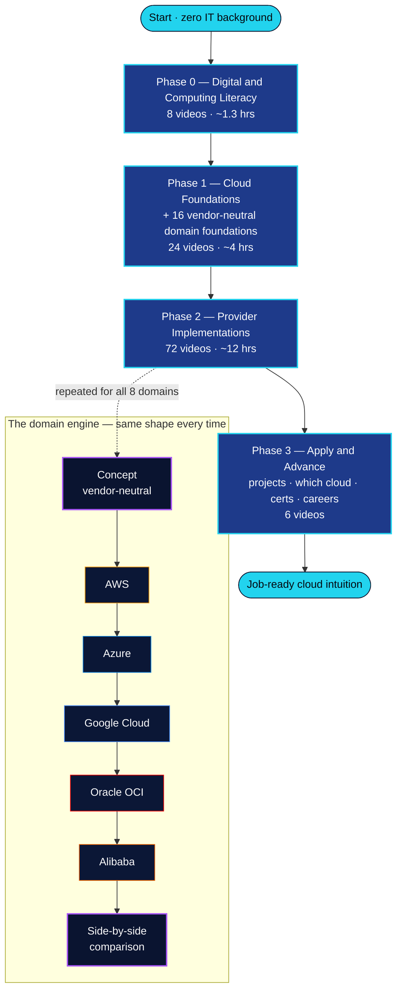
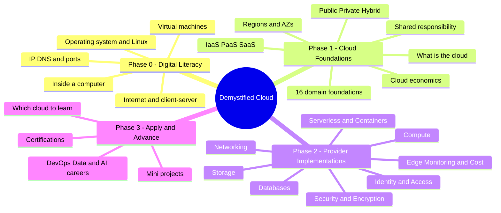
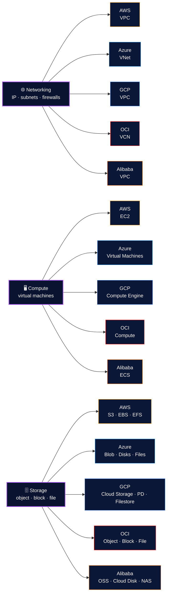

# 🗺️ Visual Learning Map

A pictorial view of the whole journey. **These diagrams render automatically on GitHub.** To export any one as a PNG/SVG, paste the code block into [mermaid.live](https://mermaid.live).

---

## 1) End‑to‑end journey

How a complete beginner moves from zero to job‑ready — and the "engine" that repeats inside Phase 2.

---

## 2) Curriculum mindmap

The same content as a branching mind map.

---

## 3) Same concept → five clouds

The core idea of the channel: learn the concept once, then recognize it in every provider's language. (Three examples shown; all domains follow this shape — full grid in the [README](../README.md).)

---

## 4) The five provider stacks (per‑provider level)

Everything you'll be able to navigate in each cloud, top to bottom, by the end of the path.

```mermaid
flowchart LR
  subgraph AWSV["☁️ AWS"]
    direction TB
    w1["Networking · VPC"] ~~~ w2["Compute · EC2"] ~~~ w3["Storage · S3 / EBS / EFS"] ~~~ w4["Databases · RDS / DynamoDB / ElastiCache"] ~~~ w5["Identity · IAM"] ~~~ w6["Security · KMS / Security Groups"] ~~~ w7["Serverless+Containers · Lambda / ECS / EKS"] ~~~ w8["Edge · ELB / Route 53 / CloudFront"] ~~~ w9["Monitoring · CloudWatch"] ~~~ w10["IaC · CloudFormation"] ~~~ w11["Messaging · SQS / SNS"] ~~~ w12["Cost · Cost Explorer"]
  end
  subgraph AZUREV["☁️ Azure"]
    direction TB
    z1["Networking · VNet"] ~~~ z2["Compute · Virtual Machines"] ~~~ z3["Storage · Blob / Disks / Files"] ~~~ z4["Databases · Azure SQL / Cosmos DB / Redis"] ~~~ z5["Identity · Entra ID + RBAC"] ~~~ z6["Security · Key Vault / NSGs"] ~~~ z7["Serverless+Containers · Functions / AKS"] ~~~ z8["Edge · Load Balancer / DNS / Front Door"] ~~~ z9["Monitoring · Azure Monitor"] ~~~ z10["IaC · ARM / Bicep"] ~~~ z11["Messaging · Service Bus / Event Grid"] ~~~ z12["Cost · Cost Management"]
  end
  subgraph GCPV["☁️ Google Cloud"]
    direction TB
    g1["Networking · VPC"] ~~~ g2["Compute · Compute Engine"] ~~~ g3["Storage · Cloud Storage / PD / Filestore"] ~~~ g4["Databases · Cloud SQL / Firestore / Memorystore"] ~~~ g5["Identity · Cloud IAM"] ~~~ g6["Security · Cloud KMS / Firewall Rules"] ~~~ g7["Serverless+Containers · Cloud Run / GKE"] ~~~ g8["Edge · Cloud LB / Cloud DNS / Cloud CDN"] ~~~ g9["Monitoring · Cloud Monitoring"] ~~~ g10["IaC · Infrastructure Manager / Terraform"] ~~~ g11["Messaging · Pub/Sub"] ~~~ g12["Cost · Cloud Billing"]
  end
  subgraph OCIV["☁️ Oracle OCI"]
    direction TB
    o1["Networking · VCN"] ~~~ o2["Compute · OCI Compute"] ~~~ o3["Storage · Object / Block / File"] ~~~ o4["Databases · Autonomous / Base DB / NoSQL"] ~~~ o5["Identity · OCI IAM"] ~~~ o6["Security · OCI Vault / Security Lists"] ~~~ o7["Serverless+Containers · Functions / OKE"] ~~~ o8["Edge · OCI LB / DNS / CDN"] ~~~ o9["Monitoring · OCI Monitoring"] ~~~ o10["IaC · Resource Manager"] ~~~ o11["Messaging · Queue / Streaming"] ~~~ o12["Cost · Cost Analysis"]
  end
  subgraph ALIV["☁️ Alibaba"]
    direction TB
    b1["Networking · VPC"] ~~~ b2["Compute · ECS"] ~~~ b3["Storage · OSS / Cloud Disk / NAS"] ~~~ b4["Databases · ApsaraDB RDS / Tablestore / Redis"] ~~~ b5["Identity · RAM"] ~~~ b6["Security · KMS / Security Groups"] ~~~ b7["Serverless+Containers · Function Compute / ACK"] ~~~ b8["Edge · ALB-NLB / DNS / CDN"] ~~~ b9["Monitoring · CloudMonitor"] ~~~ b10["IaC · ROS"] ~~~ b11["Messaging · MNS / MQ"] ~~~ b12["Cost · Billing Management"]
  end

  classDef awsbox fill:#0B1736,stroke:#FF9900,color:#ffffff;
  classDef azbox fill:#0B1736,stroke:#0078D4,color:#ffffff;
  classDef gcpbox fill:#0B1736,stroke:#4285F4,color:#ffffff;
  classDef ocibox fill:#0B1736,stroke:#F80000,color:#ffffff;
  classDef alibox fill:#0B1736,stroke:#FF6A00,color:#ffffff;
  class w1,w2,w3,w4,w5,w6,w7,w8,w9,w10,w11,w12 awsbox;
  class z1,z2,z3,z4,z5,z6,z7,z8,z9,z10,z11,z12 azbox;
  class g1,g2,g3,g4,g5,g6,g7,g8,g9,g10,g11,g12 gcpbox;
  class o1,o2,o3,o4,o5,o6,o7,o8,o9,o10,o11,o12 ocibox;
  class b1,b2,b3,b4,b5,b6,b7,b8,b9,b10,b11,b12 alibox;
```

---

> Tip: keep these diagrams in sync with [`ROADMAP.md`](ROADMAP.md). If a provider renames a service, update the stack here and the table in the README.
